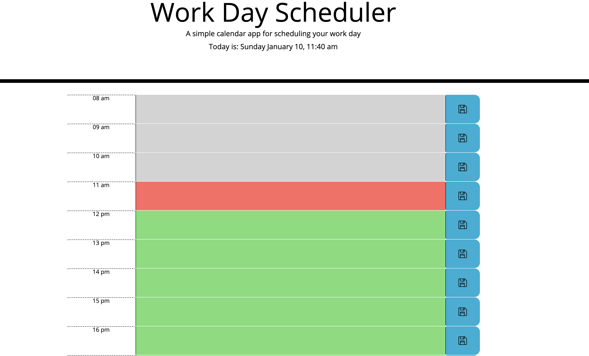

This is an assignment from UNC Coding Bootcamp in which we were tasked to creat a functioning daily planner. We are required to use at least one third party API out of a list given. I chose to work with day.js This is one that has really challenged me to think about if it is better to render dynamically or load ui in HTML and then save and update in script.

Link to live application: https://cparros.github.io/daily-planner/

